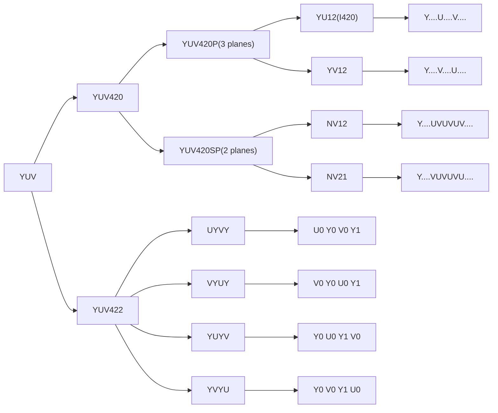

<head>
    
    
</head>

### YUV格式基本概念
参考下面的连接
https://blog.csdn.net/byhook/article/details/84037338

从opencv [ColorConversionCode](https://docs.opencv.org/4.x/d8/d01/group__imgproc__color__conversions.html#ga4e0972be5de079fed4e3a10e24ef5ef0})可以得知，YUV有两个大的分支，分别是YUV420和YUV422，假设图像宽高分别是w和h,一张图像rgb和yuv格式的尺寸如下  
YUV也可分为planar和packed两类，planar先连续存储所有像素的Y，然后存所有像素的U和V，packed每个像素的YUV是连续交叉存储   

| color space | RGB     | RGBA    | YUV420    | YUV422  |
| ----------- | ------- | ------- | --------- | ------- |
| image size  | $w*h*3$ | $w*h*4$ | $w*h*1.5$ | $w*h*2$ |

YUV420每4个Y公用一组UV，一个像素占用1.5字节  
YUV422每2个Y公用一组UV，一个像素占用2字节  
YUV420又分为YUV420P和YUV420SP  

根据[nvidia jetson multimedia API](https://docs.nvidia.com/jetson/l4t-multimedia/group__ee__nvbuffering__group.html#gaae53b45fe3f04b8f9135cb80baeac6e4)中 NvBufferColorFormat以及opencv [ColorConversionCode](https://docs.opencv.org/4.x/d8/d01/group__imgproc__color__conversions.html#ga4e0972be5de079fed4e3a10e24ef5ef0})可以整理出下列常见的YUV格式   

<!-- <!DOCTYPE html> -->
<html lang="en">
   <head>
	 
    </head>

<body>
 <!-- <pre><code class="language-mermaid">graph LR
A--&gt;B
</code></pre> -->

graph LR

A0[YUV] --> A[YUV420]
A --> B["YUV420P(3 planes)"]
A --> C["YUV420SP(2 planes)" ]
B --> D["YU12(I420)"] --> E[Y....U....V....]
B --> F["YV12"] --> G[Y....V....U....]
C --> H["NV12"] --> I[Y....UVUVUV....]
C --> J["NV21"] --> K[Y....VUVUVU....]

A0[YUV] --> A2[YUV422]
A2 --> A3[UYVY] --> A7[U0 Y0 V0 Y1]
A2 --> A4[VYUY] --> A8[V0 Y0 U0 Y1]
A2 --> A5[YUYV] --> A9[Y0 U0 Y1 V0]
A2 --> A6[YVYU] --> A10[Y0 V0 Y1 U0]

	
</body>

</html>

用opencv做下列实验，首先读取一张1280x720的rgb图像，转换为I420格式，分别打印rgb和yuv图像的尺寸   
原图：  

I420：  

