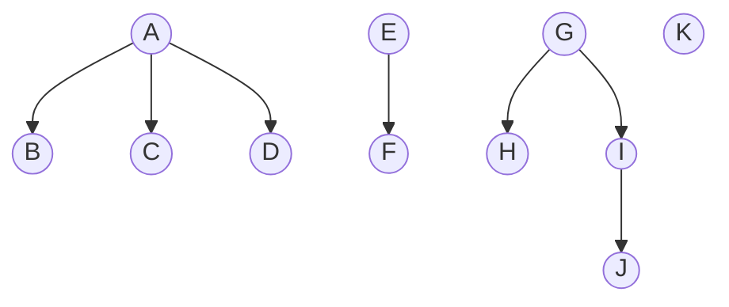

<head>
    
    
</head>

### YUV格式基本概念
参考下面的连接
https://blog.csdn.net/byhook/article/details/84037338

从opencv [ColorConversionCode](https://docs.opencv.org/4.x/d8/d01/group__imgproc__color__conversions.html#ga4e0972be5de079fed4e3a10e24ef5ef0})可以得知，YUV有两个大的分支，分别是YUV420和YUV422，假设图像宽高分别是w和h,一张图像rgb和
yuv格式的尺寸如下   

|color space|:-------------|RGB|RGBA|YUV420|YUV422|
|image size|:-------------|$w*h*3$|$w*h*4$|$w*h*1.5$|$w*h*2$|

YUV420又分为YUV420P和YUV420SP

